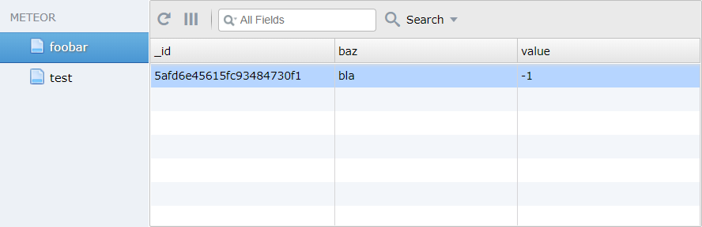

# MeteorDBAdmin (POC)
Little proof-of-concept to view and manipulate MongoDB-Collection data using [Meteor](http://meteor.com), some MongoDB Meta-information and [w2ui](http://w2ui.com/) for the visualization.

Please note that this will only display simple key-value pairs in a table where the key is used as the column name and the value is just a basic integer/string/boolean.
Works best for data imported from a rational database.
Not all complex or nested data can be visualized in a table, although with some manipulation you could build something like [the Tree-Like Grid Example](http://w2ui.com/web/demos/#!grid/grid-7) from w2ui

It is also not recommended for large data sets

